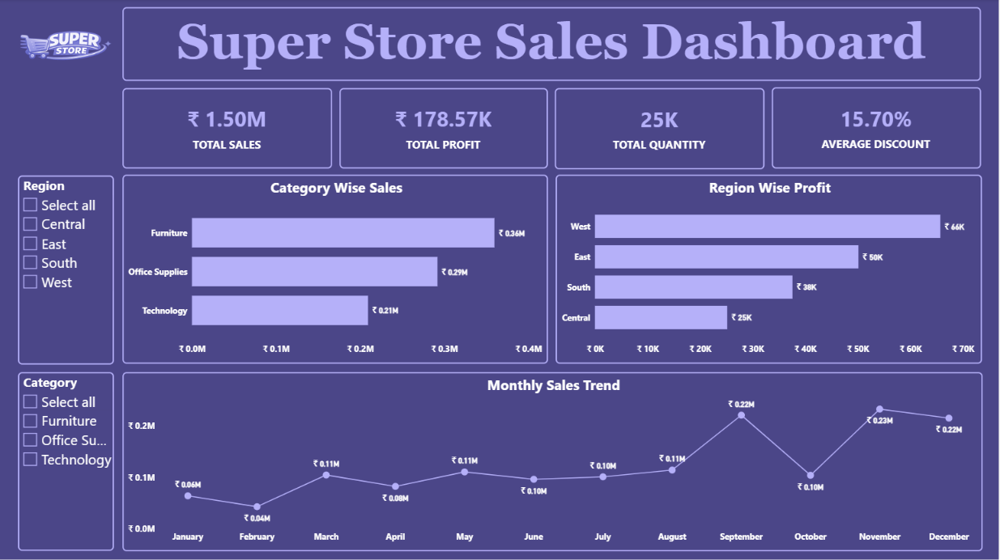

# 📊 Superstore Sales Dashboard | Power BI


## 📌 Project Overview

This project presents an interactive **Superstore Sales Dashboard** developed in **Power BI** to analyze sales performance and provide actionable business insights. The dashboard enables users to explore trends, compare metrics, and evaluate performance through dynamic visualizations and filters.

---

## 🎯 Business Objectives

- Monitor overall business performance.
- Analyze sales across different dimensions.
- Identify trends and patterns in the data.
- Compare performance by shipping methods.
- Enable data-driven decision-making through interactive reports.

---

## 📈 Key Performance Indicators (KPIs)

| KPI | Description |
|------|-------------|
| 💰 Total Sales | ₹1.50M total revenue generated across all orders |
| 📈 Total Profit | ₹178.57K overall profit earned |
| 📦 Total Quantity Sold | 25K products sold across all categories |
| 🏷️ Average Discount | 15.70% average discount offered on products |

---

## 📊 Dashboard Features

✔ Interactive visualizations

✔ Dynamic slicers and filters

✔ KPI cards for quick insights

✔ Comparative analysis

✔ Trend identification

✔ User-friendly layout

✔ Drill-down capabilities

---

## 🛠 Tools & Technologies

- **Power BI Desktop**
- **Power Query**
- **Data Visualization**

---

## 📂 Dataset

**Dataset:** Superstore Dataset

**File Format:** `.pbix`

---

## 📷 Dashboard Screenshots

### Main Dashboard

<p align="center">

</p>

---

## 📁 Repository Structure

```
📦 Superstore-Sales-Dashboard
│
├── Super_Store_Dashboard.png
├── PR.1.pbix
└── README.md
```

---

## 🚀 Getting Started

### Prerequisites

- Power BI Desktop

### Installation

1. Clone the repository:

```bash
git clone https://github.com/Pratik-Patil-AI/Super-Store-Dashboard.git
```

2. Open:

```text
PR.1.pbix
```

3. Refresh the data if required.

4. Explore the dashboard using slicers and filters.

---

## 💡 Insights Generated

- Furniture contributes the highest sales among all categories.
- The West region generates the highest profit.
- Sales show noticeable fluctuations throughout the year, with peaks in September and November.
- Interactive filters enable detailed analysis by region and category.
- The dashboard helps identify business trends and support data-driven decisions.

---

## 🔮 Future Improvements

- Add forecasting visuals.
- Introduce customer segmentation analysis.
- Include region-wise performance metrics.
- Enhance dashboard interactivity.

---

## 👨‍💻 Author

### **Pratik Patil**
**Data Analyst | Power BI Enthusiast**

---

> Built with ❤️ using **Power BI**
